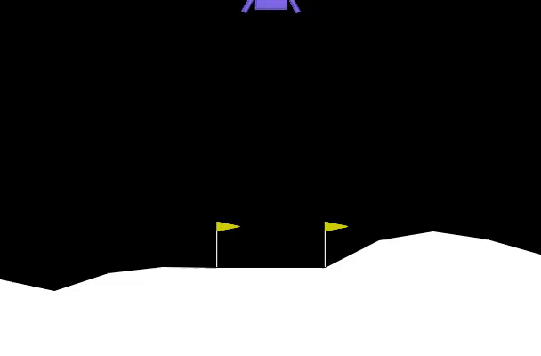

# Pure NumPy Continuous PPO: Lunar Lander (`LunarLanderContinuous-v3`)

An end-to-end implementation of **Proximal Policy Optimization (PPO)** built **entirely from scratch using pure NumPy** — no PyTorch, no TensorFlow, no autograd libraries. 

This repository implements manual forward/backward passes, an analytical Gaussian PPO loss derivation, Advantage Estimation (GAE), a custom Adam optimizer, and an H.264 video rendering pipeline inside Jupyter/Kaggle environments.

---

## Agent Landing Showcase



---

## Key Features

- **Zero-Framework RL Architecture**: Fully explicit Matrix Math for Neural Nets ($\mathbf{W}_1, \mathbf{b}_1 \dots \mathbf{W}_3, \mathbf{b}_3$) using `NumPy`.
- **Manual Backpropagation Engine**: Exact analytical gradients computed across activation functions (`tanh`), Gaussian log-probability policies, and critic value networks.
- **Custom Vectorized Adam Optimizer**: Native Python/NumPy implementation of Adam featuring bias correction, gradient norm clipping, and running moment tracking ($m_t, v_t$).
- **Continuous Action Space Policy**: Handles continuous multi-dimensional outputs (Main Thruster & Orientation Gimbal) using standard deviation parameterization ($\log \sigma$).
- **Generalized Advantage Estimation (GAE)**: Full implementation of GAE ($\gamma=0.99, \lambda=0.95$) for variance-reduced advantage calculations.
- **Embedded Notebook Video Engine**: Auto-encodes evaluation episodes directly to H.264 MP4 using `imageio` and dynamically renders HTML5 video players inline.

---

## Performance & 50-Episode Stress Test

The trained top-5 policy checkpoints were subjected to a rigorous **50-Episode Stress Test** to evaluate generalization across variable terrain, initial fuel vectors, and angular velocity perturbations.

| Rank | Ep | Mean Test Return | Max Return | Min Return | Solve Rate ($\ge 200$) | Crash Rate ($< 0$) |
| :---: | :---: | :---: | :---: | :---: | :---: | :---: |
| **Rank 1** | **490** | **$254.4 \pm 63.2$** | **313.6** | **10.1** | **92.0%** | **0.0%** |
| **Rank 2** | **390** | **$254.6 \pm 55.7$** | **311.7** | **10.8** | **94.0%** | **0.0%** |
| **Rank 3** | 330 | $232.0 \pm 80.3$ | 301.1 | $-54.8$ | 89.0% | 3.0% |
| **Rank 4** | 210 | $209.6 \pm 91.5$ | 292.8 | $-40.3$ | 76.0% | 7.0% |
| **Rank 5** | 470 | $252.8 \pm 69.0$ | 310.6 | $-197.6$ | 93.0% | 1.0% |

### Key Takeaways from Iteration 3:
1. **Zero Crash Rate achieved**: Both **Rank 1** and **Rank 2** completed all 50 evaluation episodes without a single crash ($0.0\%$ crash rate).
2. **High Solve Rate ($>92\%$)**: Ranks 1, 2, and 5 reliably scored above 200 points on almost every landing attempt.
3. **Lowest Risk (Min Return $>0$)**: Rank 1 and Rank 2 never received a negative score, with minimum returns of $+10.1$ and $+10.8$ respectively.

---

## Mathematical Architecture

### 1. Manual Gradient Derivation
The Actor network predicts a mean action vector $\mu_\theta(s)$, while learning diagonal log-standard deviations $\log \sigma$. The loss gradient with respect to the continuous Gaussian output layer is calculated analytically as:

$$\nabla_{\mu} L_{PPO} = \frac{\hat{A}_{eff} \cdot (a - \mu)}{\sigma^2 + \epsilon}$$

$$\nabla_{\log \sigma} L_{PPO} = \hat{A}_{eff} \left( \frac{(a - \mu)^2}{\sigma^2} - 1 \right) - c_{entropy}$$

Where $\hat{A}_{eff}$ represents the clipped surrogate advantage ratio gradient mask.

### 2. Custom Adam Update Logic
```python
# NumPy Adam Optimizer Step Logic
total_norm = np.sqrt(sum(np.sum(g ** 2) for g in grads_dict.values()))
if total_norm > max_grad_norm:
    grads_dict = {k: v * (max_grad_norm / (total_norm + 1e-6)) for k, v in grads_dict.items()}

lr_t = lr * (np.sqrt(1.0 - beta2 ** t) / (1.0 - beta1 ** t))
for k in params.keys():
    m[k] = beta1 * m[k] + (1.0 - beta1) * grads_dict[k]
    v[k] = beta2 * v[k] + (1.0 - beta2) * (grads_dict[k] ** 2)
    params[k] -= lr_t * m[k] / (np.sqrt(v[k]) + eps)
